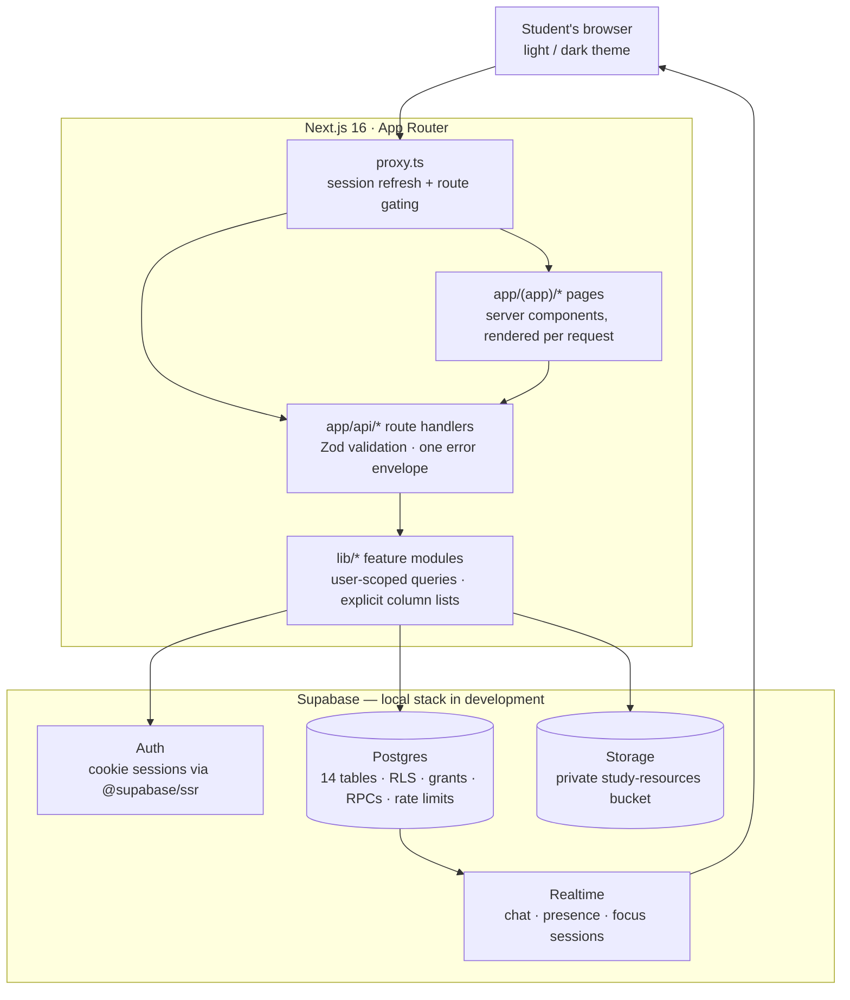
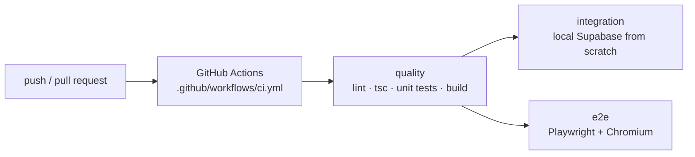

<h1 align="center">SdyRoom</h1>

<p align="center">
  <strong>Study together. Stay accountable. Achieve more.</strong>
</p>

<p align="center">
  Capacity-limited study rooms for exam prep — shared focus timers, goals, realtime
  chat, private file sharing and member safety, built with Next.js and Supabase.
</p>

<p align="center">
  <a href="https://github.com/chanukyareddygopala07/sdyroom/actions/workflows/ci.yml"></a>
  <a href="LICENSE"></a>
  <a href="https://nextjs.org"></a>
  <a href="https://www.typescriptlang.org"></a>
  <a href="https://supabase.com"></a>
  <a href="https://tailwindcss.com"></a>
</p>

<p align="center">
  <a href="#features"><strong>Features</strong></a> ·
  <a href="#demo"><strong>Demo</strong></a> ·
  <a href="#architecture"><strong>Architecture</strong></a> ·
  <a href="#security"><strong>Security</strong></a> ·
  <a href="#testing"><strong>Testing</strong></a> ·
  <a href="#getting-started"><strong>Getting Started</strong></a> ·
  <a href="#documentation"><strong>Documentation</strong></a> ·
  <a href="#contributing"><strong>Contributing</strong></a>
</p>

## 🎯 What is SdyRoom?

SdyRoom is a study-together platform for students preparing for competitive and
university examinations — JEE, NEET, GATE, semester exams and more. Sign up with a
password, pick a unique **study alias** once (your email is never shown to anyone),
discover public study rooms or create your own capacity-limited room, and study
"together" with a shared focus timer, personal goals, realtime chat and private file
sharing.

**The problem it solves:** students rarely lack content — they lack consistent
habits, focused sessions, study partners and accountability. SdyRoom makes studying
alone feel less alone **without** requiring anyone to share a phone number, email or
social profile: collaboration happens through aliases inside authenticated rooms,
guarded by database-level authorization, so it is privacy-first by construction.

Built with **Next.js 16 (App Router)** and **Supabase** (Auth, Postgres with Row
Level Security, Storage, Realtime).

<a name="features"></a>

## ✨ Features

### ✅ Implemented

- 🔑 Password authentication with cookie sessions (`@supabase/ssr`) and a one-time
  study-alias onboarding
- 🔍 Public room discovery with `?q=` search over name, subject and exam track
- 🚪 Capacity-limited rooms (1–100 seats), public/private and open/closed, with
  owner-only settings and type-the-name deletion
- ⏱ Shared focus sessions: an owner-driven timer state machine in Postgres, synced
  in realtime, with history and server-persisted expiry
- 🎯 Personal goals that stay private even from the room owner
- 💬 Realtime room chat: append-only, cursor-paginated, RLS-filtered at delivery
- 📍 Live presence on the roster (who is in the room / studying)
- 📨 Alias-addressed invitations with an inbox — no invite links to forward or
  enumerate
- 📁 Study resources: personal library + room sharing, magic-byte validation,
  20 MiB ceiling, 300-second signed downloads, storage quotas, rate limits and
  orphan cleanup
- 🛡 Member safety: reports, one-way blocks, mutes, member removal, owner-appointed
  room moderators, and a moderation inbox that never shows the reporter
- 🌗 Light and dark themes

### 🚧 In Review

Nothing is in review right now — the next candidates are listed under
[Planned](#planned) and the [Roadmap](#roadmap).

<a name="planned"></a>

### 🔮 Planned

The ordered plan lives in [`docs/PR_ROADMAP.md`](docs/PR_ROADMAP.md) and
[`docs/milestones.md`](docs/milestones.md); highlights:

- Notifications (PR 11)
- AI study assistance — document Q&A over your own notes, quizzes, a study planner
  and analytics (PRs 12–16)
- Richer room discovery (PR 17)
- Production hardening — security headers/CSP, monitoring, backups, load testing
  (PR 18)
- Mobile/responsive shell and accessibility baseline (PR 19), profile and settings
  (PR 20), coverage gates (PR 21)

<a name="demo"></a>

## 🖥️ Screenshots & Demo

No screenshots or demo recordings are checked in yet, and this repository does not
host a public deployment — so there is no live demo link to click. Run it locally
instead: [Getting Started](#getting-started).

<!-- TODO: add real screenshots/GIFs under docs/images/ and reference them here, e.g.
     <div align="center"></div>
     See docs/images/README.md for naming and size conventions. -->

<a name="architecture"></a>

## 🏗️ Architecture

Two rules describe the whole design (from
[`docs/ARCHITECTURE.md`](docs/ARCHITECTURE.md)):

1. **Authorization lives in the database.** Row Level Security policies and
   `SECURITY DEFINER` RPCs re-check every rule server-side, and the API re-checks
   the same rule before it answers — a bug in one layer leaves the other standing.
2. **Identity is never a parameter.** Handlers read the Supabase session claims;
   RPCs read `auth.uid()`; nothing accepts "on behalf of" input.



A typical request: `proxy.ts` refreshes the session (sending unauthenticated
visitors to `/auth/login`, except `/`, `/auth/*` and `/api/*`), the page or handler
validates input with Zod, a `lib/` module runs the query through the user-scoped
Supabase client, Postgres re-authorizes it through RLS / grants / RPCs, and the
response is shaped with an explicit column list — failures answer through the single
error envelope `{ error: { code, message, issues? } }`.

CI mirrors that shape:



### How the pieces fit together

- **Session**: `proxy.ts` → `lib/supabase/proxy.ts#updateSession` refreshes cookies
  and sends unauthenticated visitors (everything except `/`, `/auth/*` and `/api/*`)
  to `/auth/login`. API routes are exempt on purpose so a `fetch` client gets the
  documented JSON `401` instead of an HTML redirect. Each session-gated page re-checks the session and, for rooms, the
  profile row; they export `instant = false` because the project runs with
  `cacheComponents` and these routes must render per request.
- **Validation**: `lib/validation/` (Zod) mirrors the CHECK constraints in
  `supabase/migrations/0001_init.sql`, so bad input is rejected in the browser, at
  the API boundary and again in the database.
- **Database access**: `lib/profiles/queries.ts` and `lib/rooms/` — public rooms are
  read with an explicit column list and mapped through `toPublicRoom()`, so
  `owner_id` and any future private column can never reach a response. Rooms are
  only ever created through the `create_room` RPC, and membership only through
  `join_room` / `leave_room`: the owner (or the caller) is always taken from
  `auth.uid()` and never accepted from the client, and the seat check shares a row
  lock with the insert so racing students cannot exceed `capacity`. Occupancy is an
  aggregate over public rooms only (`public_room_member_counts`), so no participant
  identity or private-room count is ever disclosed.
- **Focus sessions**: `lib/focus/` reads through `focus_session_state` and writes
  through `start` / `pause` / `resume` / `end`, all owner-checked inside the
  database. A partial unique index allows at most one active session per room, so a
  concurrent race resolves to `already_active` instead of a second row, and
  `toFocusSession()` re-validates every payload (paused ⇔ `paused_at`, finished ⇔
  `ended_at`) before it reaches a client. The workspace page subscribes to realtime
  changes on `focus_sessions`, polls as a fallback and re-reads the same
  `getFocusWorkspace` the server rendered with, so a reconnect can never restart or
  rewind a timer.
- **Personal goals**: `lib/goals/` addresses only the caller's own rows; the partial
  unique index on `(user_id, room_id, lower(title)) where status = 'active'` yields
  `409 duplicate_goal`, the title frees up on completion, and a trigger owns
  `completed_at` / `updated_at`.
- **Room chat**: `lib/chat/` seeds history from the workspace page and appends
  through `POST /api/rooms/[id]/messages`; `room_messages` is append-only (only
  `SELECT`/`INSERT` are granted), the sender is pinned to `auth.uid()` by RLS and
  never returned as an id — the API maps it onto the viewer-relative `is_own` — and
  `seq` gives a stable total order for `before=` cursor pagination. Rows reach
  members over `supabase_realtime`, with RLS applied at delivery, and the client
  deduplicates by id because a send can be confirmed by both the POST response and
  its own event.
- **Study resources**: `lib/resources/` validates the file (magic bytes, 20 MiB
  ceiling, filename shape, unknown multipart parts rejected outright), builds the
  storage key from server-generated UUIDs only, and writes the object *before* the
  metadata row — a failed insert rolls the object back, so no orphan is advertised.
  The same scope is enforced twice, independently: table RLS for the metadata and
  storage RLS for the bytes, both derived from `auth.uid()` and current room
  membership, so a direct PostgREST or Storage call obeys exactly what the app
  obeys. `owner_id` holds no grant at all, and `storage_path` is excluded from the
  response column list. Abuse controls run in cost order: fixed-window rate limits
  (`rate_limits` table, written by `rate_limit_take`), a fail-open quota pre-check
  that refuses an over-budget upload before the bytes are written, and the
  `study_resources_quota_guard` trigger that re-decides inside the inserting
  transaction so concurrent uploads cannot race past a quota.
- **Invitations and the roster**: `lib/invitations/` addresses each invitation to
  one student's alias — there is no token, link or invite URL, so nothing can be
  forwarded or enumerated, and every transition re-derives `auth.uid()` inside a
  `SECURITY DEFINER` RPC (`0007`). The table is read-only for clients (no write
  grant), expiry is evaluated at read time (`410`, never a stored state), at most
  one pending invitation per (room, invitee) is allowed by a partial unique index,
  and acceptance seats through the same row-locked capacity code as `join_room`
  with a private gate no client can execute. The roster reads through the
  membership-checked `room_roster` RPC — `room_members` visibility is unchanged —
  and annotates rows with live presence from the PR 06 channel.
- **Member safety**: `lib/moderation/` reports, blocks, mutes, removals and
  room-moderator appointment through alias-addressed SECURITY DEFINER RPCs
  (`0009`) with no `INSERT`/`UPDATE` grant on the audit tables — the reporter is
  pinned to `auth.uid()` inside the RPC and has no column grant, so no payload
  can carry it; blocks are private to the blocker and filter that user's chat
  through one clause on the `room_messages` SELECT policy (history and live
  arrival alike); mutes are re-checked by the insert policy, so a direct
  PostgREST write cannot bypass them. There is no global admin role: every
  right is scoped to one room.
- **Errors**: one envelope for every API failure, `{ error: { code, message, issues?
  } }`, built by `lib/api/responses.ts`.

**Layout note:** the original brief assumed a `src/` tree (`src/lib/...`). This
repository keeps the starter's root-level `app/`, `lib/` and `components/`, so those
modules live at `lib/validation/`, `lib/rooms/`, `lib/profiles/` and `lib/api/`
instead of `src/lib/...`. Route and test paths are otherwise unchanged.

For the full directory map, data model (14 tables) and where decisions live, read
[`docs/ARCHITECTURE.md`](docs/ARCHITECTURE.md).

<a name="security"></a>

## 🔐 Security

- **Server-side auth gates**: pages are session-gated (middleware redirect for
  browsers, JSON `401` for APIs); every room endpoint re-checks membership, and a
  non-member gets the same `404` as a missing room (`lib/rooms/access.ts`).
- **The database is the authority**: all 14 tables are RLS-enabled and granted
  column by column (`auto_expose_new_tables = false`); privileged writes go through
  `SECURITY DEFINER` RPCs; there is no `USING (true)` policy anywhere, and identity
  is never accepted as a request parameter.
- **Private file storage**: the `study-resources` bucket is `public = false`;
  downloads are 300-second signed URLs issued only after the server re-checks
  access; content types come from magic-byte sniffing; uploads are limited by
  per-user and per-room quotas plus fixed-window rate limits, and failed writes are
  swept by an orphan cleanup.
- **Chat and moderation privacy**: chat is append-only; blocks filter at RLS
  delivery; mutes are re-checked by the insert policy; `reporter_id` has no
  `SELECT` grant, so no payload can leak who filed a report.
- **No secrets at runtime**: no service-role key exists in application code, CI runs
  with `permissions: contents: read` and zero repository secrets, and `.env.local`
  is gitignored.
- **Honest failures**: one error envelope, stable error codes, no stack traces in
  responses.

Read the threat model, security coverage and known limitations in
[`docs/SECURITY.md`](docs/SECURITY.md). To report a vulnerability, follow
[`SECURITY.md`](SECURITY.md) — please do not open a public issue.

<a name="technology"></a>

## 🛠️ Technology

| Layer | Choice |
| --- | --- |
| Framework | [Next.js](https://nextjs.org) 16.3.8 — App Router, `cacheComponents`, Proxy |
| Language | [TypeScript](https://www.typescriptlang.org) 5.9.3 (strict) |
| Backend | [Supabase](https://supabase.com) — Auth, Postgres + RLS, Storage, Realtime; pinned CLI 2.119.0 for the local stack |
| Validation | [Zod](https://zod.dev) 4.6.5, mirroring the database CHECK constraints |
| Styling | [Tailwind CSS](https://tailwindcss.com) 4.3.3 + [shadcn/ui](https://ui.shadcn.com/) on Radix UI |
| Tests | [Vitest](https://vitest.dev) 5.0.3 (unit + integration), [Playwright](https://playwright.dev) 1.63 (e2e), Testing Library |
| Linting | ESLint 9 flat config via `eslint-config-next` 16.3.8 |

### Pinned dependency versions

All dependencies are pinned to exact versions (no `^`, `~` or `latest`) in `package.json`.

| Package | Version |
| --- | --- |
| next | **16.3.8** |
| react / react-dom | 19.3.0 |
| typescript | 5.9.3 |
| zod | 4.6.5 |
| @supabase/ssr | 0.12.7 |
| @supabase/supabase-js | 2.117.2 |
| supabase (CLI, devDependency) | 2.119.0 |
| tailwindcss | 4.3.3 |
| @tailwindcss/postcss | 4.3.3 |
| eslint-config-next | 16.3.8 |
| vitest | 5.0.3 |
| vite | 8.3.2 |
| jsdom | 30.1.2 |

**Next.js 16.3.8 is an intentional, security-driven deviation from the originally
specified 16.3.4.** 16.3.8 is the patched release on the 16.3.x line and is what the
approved Supabase starter resolves to; keep this pin and do not downgrade to 16.3.4.

`eslint-config-next` is pinned to **16.3.8 to match Next.js 16.3.8** (it must stay on
the same release as `next`). It ships a native flat config, which `eslint.config.mjs`
spreads directly — `FlatCompat`/`@eslint/eslintrc` is no longer used.

### Tailwind CSS 4

Styling runs on **Tailwind CSS 4.3.3** with `@tailwindcss/postcss` (PostCSS plugin).
The migration replaced the v3 trio (`tailwindcss` + `autoprefixer` + `tailwind.config.ts`):

- `postcss.config.mjs` uses `@tailwindcss/postcss` only; `autoprefixer` was removed
  (Tailwind 4 emits vendor prefixes itself).
- `app/globals.css` is CSS-first: `@import "tailwindcss"`, `@plugin "tailwindcss-animate"`,
  `@custom-variant dark` for the class-based dark mode, and `@theme inline` for the
  shadcn colour/radius tokens (the `--radius-*` and `hsl(var(--*))` values match the
  old JS config).
- `tailwind.config.ts` was deleted; source detection is automatic.
- Class renames for v4: `shadow` → `shadow-sm`, `shadow-sm` → `shadow-xs`,
  `outline-none` → `outline-hidden`, `bg-gradient-*` → `bg-linear-*`, and the removed
  `origin-[--var]` shorthand → `origin-[var(--var)]`.

### npm audit

`npm audit --omit=dev` (production dependencies): **0 vulnerabilities**.

`npm audit` (all dependencies): **5 high**, all in the dev toolchain and all one chain
rooted in a single advisory:

| Advisory | Package | Range |
| --- | --- | --- |
| [GHSA-vfj7-8cjw-p6xm](https://github.com/advisories/GHSA-vfj7-8cjw-p6xm) — stack-exhaustion DoS via deeply nested patterns (high) | `braces` | `<=3.0.3` |

Propagation: `braces` ← `micromatch` ← `fast-glob` ← `@next/eslint-plugin-next@16.3.8`
← `eslint-config-next@16.3.8`.

`braces@3.0.3` is the newest release on npm, so **no fixed version exists yet**; npm's
only suggested resolution is a downgrade of `eslint-config-next` to 14.2.35, which is
rejected. Nothing is suppressed and `--force` / `--legacy-peer-deps` are not used.
Re-check `npm audit` on every dependency update: the count fell from 7 to 5 with the
Tailwind CSS 4 migration (removing the `tailwindcss@3` → `chokidar` → `braces` path).

<a name="testing"></a>

## 🧪 Testing

Current suite: **778 unit** (60 files), **265 integration** (15 files), **38 e2e**
(11 specs).

- `npm test` (alias `npm run test:unit`) runs `vitest run` over `tests/unit/**` in the
  Node environment. It never contacts Supabase and passes without a local stack running.
  Individual UI test files opt into jsdom with a `@vitest-environment jsdom` docblock.
- `npm run test:integration` runs `vitest run --config vitest.integration.config.ts`
  over `tests/integration/**` — 265 tests covering auth at the API boundary, onboarding
  and response privacy, RLS/grant behaviour per role, `create_room` atomicity
  (including the revoked-grant rollback), joining and capacity races, the shared focus
  timer state machine, personal-goal privacy, append-only room chat, the whole
  study-resource authorization model (private library, room sharing, revocation on
  leaving, signed URLs, impersonation of another student's folder, bucket privacy),
  live Realtime delivery of `focus_sessions` changes over a real WebSocket, the
  addressed-invitation lifecycle (create/accept/reject/revoke/expiry, the last-seat
  accept race, roster denial for non-members, policy and grant freezes), room
  management, member moderation (report workflow with reporter privacy, mute
  lifecycle with the direct-insert control, moderator appointment, one-way block
  filtering, member removal, audit-row and grant probes, cross-room isolation), and
  resource hardening (the `rate_limits` freeze with a grant-revoke control, `413`/`415`,
  the bucket's own oversized-put refusal independent of the app,
  upload/delete/sweep `429`s, both orphan-sweep directions, the quota chain
  including a two-upload race resolved by the database trigger, and the
  signed-download serve review) —
  every suite shares a single control test that widens a grant and rolls it back.
  It needs
  the local stack (`npx supabase start && npx supabase db reset`) and never uses a
  service-role key. `passWithNoTests` stays unset, so a missing suite still exits
  non-zero. See `tests/integration/README.md`.
- `npm run test:e2e` runs `playwright test` over `tests/e2e/**` — 38 Chromium tests
  driving the real app (`next dev`) against the local stack: the full two-student
  workflow through the forms, private-room access, room chat, room presence across
  two browsers, the invitation lifecycle (invite by alias → inbox → accept, stranger
  negatives, reject/revoke/expiry, a full room), the upload → share →
  revoke → delete file lifecycle through the real upload form, room settings →
  close → name-typed delete across two browsers, expiry/failure/recovery
  scenarios, Realtime-vs-polling proven on an intercepted WebSocket (including
  stale and duplicate frame replay), member safety (message report → owner's
  moderation inbox → review → resolve with no reporter identity shown, one-way
  block filtering, owner mute → disabled composer → removal to a 404, and the
  documented refusal codes for anonymous, non-member and plain-member API
  attempts), and resource hardening (oversize/extension preflights failing in the
  browser, the quota line and quota-full locking, and a spent upload window
  answered with `429` + `Retry-After`). Test users are scoped to a per-run id and deleted
  by the global teardown (which also removes this run's storage objects before its
  `auth.users` rows). It needs the local stack plus `npx playwright install chromium`.
  See `tests/e2e/README.md`.
- `.github/workflows/ci.yml` runs all three suites on every push and pull request: a
  `quality` job (lint, types, unit tests, build — no env or secrets) and — each after
  `quality` — an `integration` job and an `e2e` job that stand up their own isolated
  local Supabase, apply migrations from scratch and run their suite (the e2e job also
  installs Chromium and uploads the Playwright report on failure). All jobs use the
  Node version pinned in `.nvmrc`, and the workflow is `permissions: contents: read`
  with no repository secrets.

See [`CONTRIBUTING.md`](CONTRIBUTING.md) for the exact commands to run before you
open a pull request.

<a name="roadmap"></a>

## 🗺️ Roadmap

| Status | PRs |
| --- | --- |
| ✅ Merged | #1–#10 — chat, realtime, focus sessions & goals, room discovery, resources, presence, invitations & roster, room management, member safety, resource security |
| ⏳ Pending | #11–#21 — notifications, AI study assistance, richer discovery, production hardening, mobile & accessibility, profile/settings, coverage gates |

Details, order and acceptance criteria:
[`docs/PR_ROADMAP.md`](docs/PR_ROADMAP.md) ·
[`docs/milestones.md`](docs/milestones.md) ·
[project wiki](https://github.com/chanukyareddygopala07/sdyroom/wiki)

<a name="getting-started"></a>

## 🚀 Getting Started

### Prerequisites

- **Node.js 24** (the version pinned in `.nvmrc`) and npm
- **Docker** — the local Supabase stack runs in containers (several GB of disk)
- `npx playwright install chromium` before running e2e tests

### Run locally

```bash
git clone https://github.com/chanukyareddygopala07/sdyroom.git
cd sdyroom
npm ci
```

1. Copy `.env.example` to `.env.local` and fill it from the local stack
   (`npx supabase status -o env`) — only two public, browser-safe values:

   ```env
   NEXT_PUBLIC_SUPABASE_URL=http://127.0.0.1:54321
   NEXT_PUBLIC_SUPABASE_PUBLISHABLE_KEY=<local publishable key>
   ```

2. Start the local stack and apply every migration:

   ```bash
   npx supabase start
   npx supabase db reset
   ```

3. Start the app:

   ```bash
   npm run dev
   ```

   The app runs on [localhost:3000](http://localhost:3000/).

### Scripts

| Script | What it does |
| --- | --- |
| `npm run dev` | Next.js dev server |
| `npm run build` | Production build |
| `npm start` | Serve the production build |
| `npm run lint` | ESLint (flat config) |
| `npx tsc --noEmit` | Type check (what CI runs; there is no `typecheck` script) |
| `npm test` / `npm run test:unit` | Unit suite (no network, no stack needed) |
| `npm run test:integration` | Integration suite (needs the local stack + `db reset`) |
| `npm run test:e2e` | Playwright e2e (needs the local stack + Chromium) |

### Local Supabase

The database foundation runs entirely locally through the pinned CLI
(`npx supabase start`), with Postgres on port **54322** — never the Homebrew server on
5432. See [docs/local-supabase.md](docs/local-supabase.md) for the schema, grants, RLS
policies, the private `study-resources` bucket and its storage policies, the
`create_room` RPC, how owner-membership atomicity is enforced, and the verification
commands.

<a name="documentation"></a>

## 📚 Documentation

| Document | What it answers |
| --- | --- |
| [Project wiki](https://github.com/chanukyareddygopala07/sdyroom/wiki) | Product vision, positioning and feature overview |
| [docs/ARCHITECTURE.md](docs/ARCHITECTURE.md) | How the layers fit together, directory map, data model |
| [docs/API_CONTRACTS.md](docs/API_CONTRACTS.md) | What every endpoint accepts and returns |
| [docs/SECURITY.md](docs/SECURITY.md) | Threat model, security coverage, known limitations |
| [docs/local-supabase.md](docs/local-supabase.md) | Local database: schema, grants, policies, verification |
| [docs/PR_ROADMAP.md](docs/PR_ROADMAP.md) · [docs/milestones.md](docs/milestones.md) | What shipped, what is next, in what order |
| [docs/prs/](docs/prs/) | Per-PR specifications and reconciliation notes |
| [tests/integration/README.md](tests/integration/README.md) · [tests/e2e/README.md](tests/e2e/README.md) | How the suites run and what they prove |
| [CONTRIBUTING.md](CONTRIBUTING.md) | Development workflow and pull-request checklist |
| [SECURITY.md](SECURITY.md) | How to report a vulnerability |
| [docs/images/README.md](docs/images/README.md) | Screenshot and demo asset conventions |

## 🧭 Application & API

SdyRoom is a minimal working application on top of this starter: sign up, pick a
unique study alias once, then discover public rooms and create your own.

| Route | Access | What it does |
| --- | --- | --- |
| `/` | public | Landing page with sign-up and browse calls to action |
| `/auth/*` | public | Password auth. Local Supabase has email auto-confirm on, so sign-up returns a session and routes to `/onboarding`; otherwise the success page is shown |
| `/onboarding` | signed in | One-time study alias via `POST /api/profile` |
| `/rooms` | signed in | Public room discovery with a `?q=` search over name, subject and exam track; rooms you belong to link straight into their workspace |
| `/rooms/new` | signed in, alias chosen | Create a room via `POST /api/rooms` and enter its workspace |
| `/invitations` | signed in | Your invitation inbox: accept or reject invitations addressed to your alias |
| `/rooms/[id]/settings` | room owner | Rename the room, edit its details, adjust capacity, open/close it, and the type-the-name delete danger zone; `notFound()` for anyone who is not the owner |
| `GET /api/rooms` | signed in | Shaped public rooms, `401` when unauthenticated |
| `POST /api/profile` | signed in | Creates the profile row, `409 alias_taken` on a case-insensitive collision |
| `POST /api/rooms` | signed in, alias chosen | `401` / `400 validation` / `403 onboarding_required` / `201` |
| `POST /api/rooms/[id]/join` | signed in | `201 joined` / `200 already_member`; `404 not_found` for a missing or private room, `409 room_closed` / `room_full`, `400` for a non-UUID id or any field in the body |
| `POST /api/rooms/[id]/leave` | signed in | `200 left`; `404 not_found`, `409 owner_cannot_leave` / `not_a_member`, `400` as above |
| `/rooms/[id]` | signed in, member | The study workspace: member roster with the per-member action menu (report / block / mute / remove / appoint), shared focus timer, recent sessions, the caller's own goals, room chat and the files shared into the room; owners of private rooms also get the invite panel, and owners/moderators get the moderation inbox |
| `GET /api/rooms/[id]/workspace` | signed in, member | `{ room, session, viewer_role, server_now_ms, member_count, history }`; `404 not_found` for a non-member *and* a missing room (indistinguishable) |
| `POST /api/rooms/[id]/session/start` | room owner | `201 started` / `200 already_active` (one active session per room, races included); `403 not_owner`, `404 not_found`, `400 validation` for a duration outside 60–7200 s |
| `POST /api/rooms/[id]/session/pause` / `resume` / `end` | room owner | `200 paused` / `resumed` / `completed`; `409 no_active_session` / `invalid_state`, `403 not_owner`, `400 invalid_request` for a body carrying fields |
| `GET /api/rooms/[id]/goals` | signed in, member | The caller's own goals in that room — never another member's; `404 not_found` for a non-member |
| `POST /api/rooms/[id]/goals` | signed in, member | `201 { goal }`; `409 duplicate_goal` while an active goal with the same title exists |
| `PATCH` / `DELETE /api/goals/[goalId]` | goal owner | `200 { goal }` / `200 { deleted: true }`; `404 not_found` for anyone else's goal, `400 invalid_request` for an empty `PATCH` |
| `GET` / `POST /api/rooms/[id]/messages` | signed in, member | Chat history (newest page first, `before=` cursor on the monotonic `seq`) / `201` append; `404 not_found` for a non-member; the sender id always comes from the session |
| `POST` / `GET /api/rooms/[id]/invitations` | room owner | Invite a student **by alias** (`{ invitee_alias, ttl_hours? }`, 1–168 h) → `201`; list the room's invitations → `200`. `403 not_owner`, `404 not_found` / `invitee_not_found`, `409 room_public` / `self_invite` / `already_member` / `already_invited` |
| `DELETE /api/rooms/[id]/invitations/[invitationId]` | room owner | `200 { revoked: true }`; an already-resolved invitation (or a second revoke) is `404 not_found`, indistinguishable |
| `GET /api/invitations` | signed in | The caller's invitation inbox (rows addressed to them), newest first |
| `POST /api/invitations/[id]/accept` | the invitee | Empty body; `201 joined` / `200 already_member` (the invitation is consumed either way); `404` for anything not addressed to you, `409 used` / `rejected` / `revoked` / `room_full` / `room_closed` / `blocked` (you blocked the inviter), `410 expired` |
| `POST /api/invitations/[id]/reject` | the invitee | Empty body → `200 { rejected: true }`; same `404` / `409` / `410` map as accept |
| `GET /api/rooms/[id]/members` | signed in, member | `{ members: [{ alias, role, joined_at }], count }` — the roster; `404 not_found` for a non-member, and no user ids or emails in the payload |
| `POST` / `GET /api/rooms/[id]/reports` | signed in, member / room moderator | File a report on a message, member or file (`201`, idempotent `200` on a duplicate open report; the reporter is pinned server-side and never returned) / the moderation inbox (`403 not_moderator`, no `reporter_id` column exists to leak) |
| `PATCH /api/reports/[reportId]` | report's room owner/moderator | `200 { report }` through `pending → reviewing → resolved\|dismissed`; `404` for anyone else (no existence oracle), `409 invalid_transition`, one audit row per change |
| `DELETE /api/rooms/[id]/members/[alias]` | owner or moderator | `200 { removed, member_count }`; `403 not_owner`… `cannot_remove_owner` / `cannot_remove_self` / `not_moderator`, `404` for a non-member caller — the target loses every room surface immediately |
| `POST` / `DELETE /api/rooms/[id]/members/[alias]/mute` | owner or moderator | `201 { muted, muted_until, duration }` for `1h` / `24h` / `7d` / `200 { unmuted: true }`; `403 not_moderator` / `cannot_mute_self` / `cannot_mute_owner` / `cannot_mute_moderator`, `409 already_muted` / `not_muted`; enforced again in the `room_messages` insert policy |
| `POST` / `DELETE /api/rooms/[id]/members/[alias]/moderator` | room owner | `200 { role, changed, granted }` — appoint or revoke a room moderator; `403 not_owner` / `cannot_moderate_owner`, `404 not_found` |
| `POST` / `GET /api/blocks` | signed in | Block a student by alias (`201` / idempotent `200 { created: false }`, `409 self_block`) / the caller's own blocks only (`{ blocks, count }`) — nobody else can see whom you blocked |
| `DELETE /api/blocks/[alias]` | signed in | `200 { removed }` (idempotent); unblocking restores the filtered chat and re-enables invitations |
| `PATCH /api/rooms/[id]` | room owner | Partial edit of name / shared goal / exam track / subject / language / capacity / status → `200 { room }` (the stored row); `403 not_owner`, `404 not_found` for a non-member *and* a missing room, `409 capacity_below_membership`, `400 invalid_request` for an empty body / `validation` for a bad value or an unknown key such as `owner_id`, `401` |
| `DELETE /api/rooms/[id]` | room owner | Sweeps `rooms/{id}/**` out of the bucket first, then cascades every dependent row → `200 { deleted: true }`; `403 not_owner`, `404 not_found` for a non-member, a missing room, or a repeat delete, `500 cleanup_failed` / `delete_failed` (room intact, retry converges) |
| `/resources` | signed in | The personal library: upload, search and filter your own files, open them through a short-lived signed URL, see your storage quota, delete them |
| `GET /api/resources` | signed in | `?scope=personal` (default) or `?room_id=<uuid>`, plus `q` / `subject` / `chapter` / `limit` / `offset`; `200` includes `quota` (`{ scope, used_bytes, limit_bytes, user_used_bytes, user_limit_bytes }`) for the listed scope; `400` for both `scope` and `room_id` or a bad value, `404` for a room you have left |
| `POST /api/resources` | signed in | multipart upload → `201`; `400` `validation` / `invalid_request` / `invalid_filename` / `empty_file` / `malformed_file`, `409 quota_exceeded` (1 GiB per user / 500 MiB per room), `413 file_too_large`, `415 unsupported_file_type`, `429 rate_limited` (user + target upload windows, `Retry-After`), `404` for a room you are not in, `500` `storage_upload_failed` / `metadata_failed` |
| `GET /api/resources/[id]/download` | signed in, can read it | `200 { url, expires_in: 300, resource_id }` — authorization is re-checked on every call; `404 not_found` for a missing, deleted or foreign file, `429 rate_limited` |
| `DELETE /api/resources/[id]` | uploader | `200 { deleted: true }`; object removed before the row; `404 not_found` for anyone else's file, `429 rate_limited`, `500 cleanup_failed` / `delete_failed` |
| `POST /api/resources/cleanup` | signed in (room scope: member) | Sweep one scope for orphaned bytes left behind by failed writes: `200 { removed_objects, removed_rows, scope, room_id }`; objects/rows younger than 60 s are skipped in both directions; `400` validation, `404` for a room you are not in, `429 rate_limited` |

Endpoints that consume scarce resources — reports, blocks, mutes, invitation
creation and the file endpoints above — additionally answer `429 rate_limited`
with a `Retry-After` header once their fixed-window budget is spent;
[`docs/API_CONTRACTS.md`](docs/API_CONTRACTS.md) holds the authoritative per-endpoint
contracts.

Both membership endpoints take an empty body on purpose: the user is read from the
session, and a body that carries a `user_id` is rejected with `400 invalid_request`
instead of being quietly ignored. Success bodies are
`{ "membership": "...", "member_count": n }`, where `member_count` is the aggregate
seat usage for a public room and `null` for a private one.

Focus sessions and goals follow the same rule. The timer is a state machine owned by
PostgreSQL (`running → paused → running`, ending as `completed` when the owner stops
early or `expired` when the deadline passes — expiry is persisted by the next read or
start, so nobody's browser has to stay open). Every timestamp comes from the database,
the countdown is derived from `server_now_ms`, and `focus_sessions` is `SELECT`-only
for clients: starting, pausing, resuming and ending go through owner-only `SECURITY
DEFINER` RPCs, so a direct `INSERT`/`UPDATE` cannot start a session or rewind a
deadline. Goals are personal — RLS narrows `study_goals` to `user_id = auth.uid()`,
so even the room owner cannot read anyone else's titles, and `completed_at` is written
by a trigger rather than accepted from a client.

Files follow the same rule. A *resource* is a PDF, a scan of handwritten notes
or a plain-text/Markdown note, and it is **private by default**: `room_id IS
NULL` means only the uploader ever reads it, while a non-null `room_id` shares
it with that room's *current* members — leaving the room revokes access on the
next query without a single file being moved. Nothing is ever public: the
`study-resources` bucket is `public = false`, a download is a 300-second signed
URL issued only after the server re-checks ownership or membership, and no
endpoint accepts an owner id, a content type or a storage path from the client
(an `owner_id` in the upload body is a `400 invalid_request`, not a value that
quietly goes nowhere). The content type comes from sniffing the first bytes
server-side, so a file cannot claim to be a PDF it is not, and deletion is the
uploader's alone. `docs/ARCHITECTURE.md` is the map of how the layers fit
together, `docs/API_CONTRACTS.md` holds the endpoint contracts and
`docs/SECURITY.md` the threat model behind them.

<a name="contributing"></a>

## 🤝 Contributing

Contributions are welcome. Start with
[`CONTRIBUTING.md`](CONTRIBUTING.md) — it covers the environment setup, the exact
gates CI runs (`npm run lint`, `npx tsc --noEmit`, `npm test`, `npm run build`, plus
the integration and e2e suites), and the pull-request checklist.

- Bugs and feature requests: [open an issue](https://github.com/chanukyareddygopala07/sdyroom/issues)
- Vulnerabilities: follow [`SECURITY.md`](SECURITY.md) instead of a public issue

<a name="license"></a>

## 📜 License

Licensed under the [MIT License](LICENSE) — see the license file for details.

Built from the Supabase Next.js starter kit.
